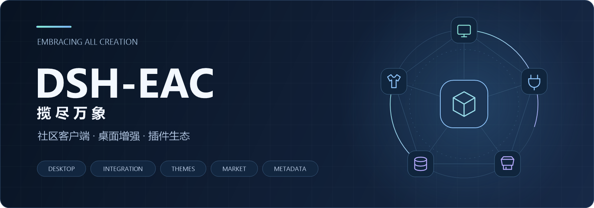

  

### 致力于让数百个DSH插件和谐共存

共同建设 [DeepSeek Harness](https://github.com/deepseek-ai/deepseek-harness)生态

**Embracing All Creation · 揽尽万象**

 

 

[桌面客户端](https://github.com/DSH-EAC/DSH-Desktop-EAC) &nbsp; · &nbsp; [插件整合包](https://github.com/DSH-EAC/EAC-Plugin-Integration-Pack) &nbsp; · &nbsp; [探索生态](#插件与皮肤生态) &nbsp; · &nbsp; [参与共建](#一起让体验更好) &nbsp; · &nbsp; [维护团队](#维护团队)

---

## 两种入口，自由选择

直接使用 EAC 桌面客户端，或在官方 Desktop 中接入 EAC / AIO。 
选择适合自己的方式，让丰富的插件能力融入日常使用。

<table width="100%">
<tr>
<td width="50%" valign="top">

01 / DESKTOP

<h3>EAC-Desktop</h3>

<strong>开箱即用的 DSH 桌面客户端。</strong>

整合桌面体验、插件能力与界面定制，为日常使用提供更完整、更顺手的工作空间。

桌面集成 &nbsp; · &nbsp; 插件扩展 &nbsp; · &nbsp; 个性化界面

<a href="https://github.com/DSH-EAC/EAC-Desktop">查看项目 →</a> &nbsp; <a href="https://github.com/DSH-EAC/DSH-Desktop-EAC/releases">获取客户端</a>

</td>
<td width="50%" valign="top">

02 / INTEGRATION PACK

<h3>EAC-Pack</h3>

<strong>保留官方 Desktop，体验 EAC / AIO。</strong>

将 EAC / AIO 的插件与皮肤整合为一个插件包，让完整的增强体验融入熟悉的官方 Desktop。

插件整合 &nbsp; · &nbsp; 统一管理 &nbsp; · &nbsp; 便捷更新

<a href="https://github.com/DSH-EAC/EAC-Pack">查看项目 →</a> &nbsp; <a href="https://github.com/DSH-EAC/EAC-Plugin-Integration-Pack#readme">安装与使用</a>

</td>
</tr>
</table>

## 插件与皮肤生态

从界面的个性化，到插件的发现与分发，让好的创作更容易被看见、被使用。

| 产品 | 我们希望带来的体验 |
| :--- | :--- |
| **03 · [皮肤管理器插件](https://github.com/DSH-EAC/dsh-ui-skin-loader)** | 发现、切换与管理皮肤，让桌面呈现你喜欢的样子。 |
| **04 · 插件市场** &nbsp; `开发中` | 连接插件作者与使用者，让发现、选择和管理插件更简单。 |
| **05 · 插件元数据源** &nbsp; `开发中` | 为插件市场与生态工具提供结构化插件信息，连接内容与分发。 |

更多探索：<a href="https://github.com/DSH-EAC/dsh-mojobox">DSH Mojobox</a> · <a href="https://github.com/DSH-EAC/dsh-ui-skin-loader-convention">皮肤创作公约</a> · <a href="https://github.com/DSH-EAC/dsh-skin-prompt-packages">皮肤 Prompt 资料包</a>

## 一起，让体验更好

我们相信，好的桌面体验来自不同创作的相互连接。

欢迎分享使用反馈、创作插件与皮肤，或参与代码、设计、文档和测试。 
从一个具体的想法、一处细节的改进开始，一起拓展 DSH 的更多可能。

**[探索所有项目](https://github.com/orgs/DSH-EAC/repositories)** &nbsp; · &nbsp; **[关注开发计划](https://github.com/orgs/DSH-EAC/projects)**

感谢 DeepSeek Harness 上游，以及每一位贡献代码、设计、皮肤、文档与反馈的朋友。

## 维护团队

<!-- TEAM:START -->
<table>
<tr>
<td align="center" valign="top" width="180">
 
<strong><a href="https://github.com/metaone01">metaone01</a></strong> 

</td>
<td align="center" valign="top" width="180">
 
<strong><a href="https://github.com/says693">says693</a></strong> 

</td>
<td align="center" valign="top" width="180">
 
<strong><a href="https://github.com/T-Auto">T-Auto</a></strong> 

</td>
<td align="center" valign="top" width="180">
 
<strong><a href="https://github.com/Ebony-Vinyl">Ebony-Vinyl</a></strong> 

</td>
</tr>
</table>

按账号名称排序，不分先后。职责后续补充。
<!-- TEAM:END -->

## 贡献者

感谢每一位让 EAC 变得更好的朋友。

<!-- CONTRIBUTORS:START -->

<!-- CONTRIBUTORS:END -->

头像汇总自组织各公开仓库的 GitHub 提交贡献统计，跨仓库按账号去重、按名称排序，不代表贡献排名。也感谢尚未关联 GitHub 账号，以及贡献设计、测试、文档、反馈与建议的参与者。

## License

各项目遵循其仓库中的许可证；插件、皮肤及其他第三方内容保留各自的授权与署名要求。使用、修改或分发前，请查看对应项目的 LICENSE 与版权声明。

---

  <strong>揽尽万象，自由组合。</strong> 
  DSH-EAC · Embracing All Creation

